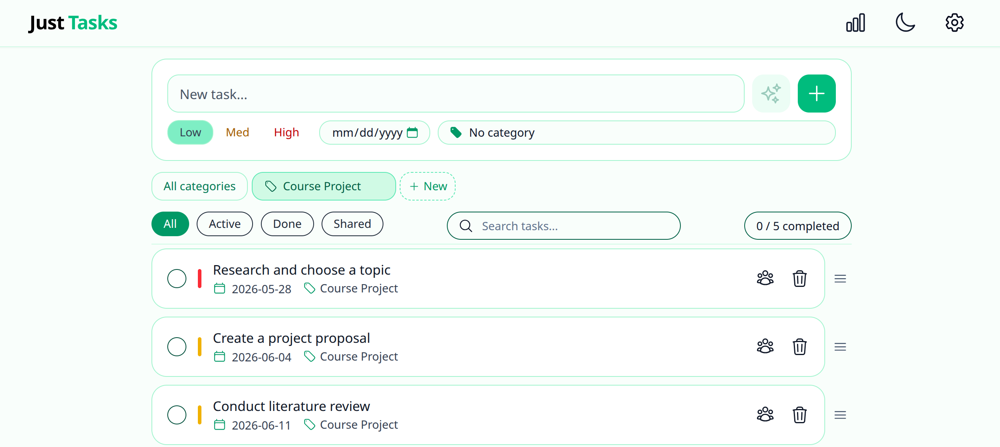
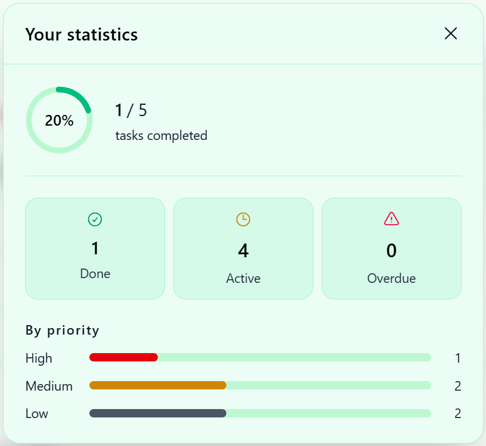

# Just Tasks

**University project:** A minimalist full‑stack task manager with user authentication, priorities, and deadlines.

---

## Screenshots




---

## Stack

| layer     | technology                               |
|-----------|------------------------------------------|
| frontend  | vue 3, typescript, vite, tailwind css |
| state     | pinia, vue router 4                     |
| backend   | php 8.2, pdo, sessions                 |
| database  | mysql 8.0                                |
| infra     | docker compose                           |

---

## Features

User Management
- Authentication: Secure registration, login, and logout functionality.
- Account control: Option to permanently delete an account with SQL Cascade Delete (all associated tasks are removed automatically).

Task Management
- Full CRUD: Create, inline edit, and delete tasks.
- Priority levels: Organize your workflow with Low, Medium, and High priorities.
- Deadlines: Track dates with visual overdue warnings for expired tasks.
- Organization: Custom Drag & Drop reordering for personal prioritization.

Search & Analytics
- Smart filtering: Live search and filtering by completion status.
- Progress tracking: Completion statistics featuring a visual progress ring.

---

## Getting started
```bash
git clone https://github.com/Andrii-K-17/just-tasks.git
cd just-tasks
```
```bash
cp .env.example .env
```
```bash
docker-compose up -d --build
```

open `http://localhost:5173`

---

## Project structure
```
just-tasks/
├── docker-compose.yml   # Docker services configuration
├── init.sql             # Database schema initialization
├── .env.example         # Template for environment variables
│
├── backend/             # PHP API (Apache)
│   ├── Dockerfile
│   ├── .htaccess        # URL rewriting rules
│   ├── 000-default.conf # Apache virtual host config
│   ├── config.php       # PDO database connection
│   ├── index.php        # API entry point & simple router
│   └── handlers/
│       ├── auth.php     # Logic for login, register, and session
│       └── tasks.php    # CRUD operations for task management
│
├── frontend/            # Vue 3 + Vite + TypeScript
│   ├── vite.config.ts
│   ├── tsconfig.json    # TypeScript configuration
│   └── src/
│       ├── main.ts      # App initialization (Pinia, Router)
│       ├── App.vue      # Root component
│       ├── api/         # Fetch wrappers for backend communication
│       ├── components/
│       │   ├── TaskForm.vue    # Input for new tasks (priority, deadline)
│       │   ├── TaskItem.vue    # Task row with edit/delete actions
│       │   ├── TaskList.vue    # Main container for task items
│       │   ├── SearchBar.vue   # Filter & search functionality
│       │   └── StatsModal.vue  # Charts & productivity breakdown
│       ├── stores/
│       │   ├── useAuthStore.ts # Global authentication state
│       │   └── useTaskStore.ts # Task state, filtering logic & stats
│       ├── router/ # Vue Router paths & navigation guards
│       ├── types/  # TypeScript interfaces & enums
│       └── views/  # Page-level components
│
└── screenshots/    # Preview images for documentation
```

---

## Api
```
POST   /api/register        create account
POST   /api/login           authenticate
POST   /api/logout          end session
GET    /api/me              current user

GET    /api/tasks           list tasks
POST   /api/tasks           create task
PUT    /api/tasks/:id       update task
PUT    /api/tasks/reorder   reorder tasks
DELETE /api/tasks/:id       delete task

DELETE /api/account         delete account + all tasks
```

---

## Environment
```bash
DB_HOST=db
DB_NAME=todo_db
DB_USER=appuser
DB_PASSWORD=your_password
```

---

## License

mit
