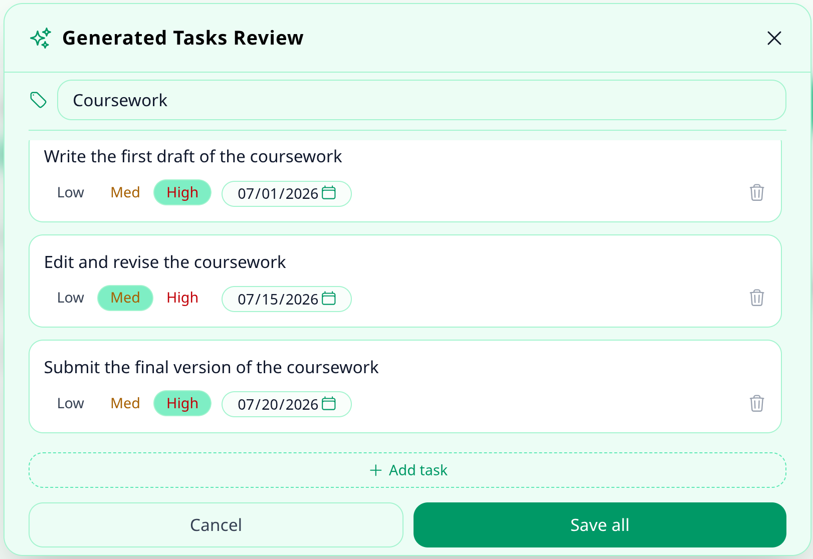

# Just Tasks

A minimalist full‑stack task manager with user authentication, priorities, deadlines, categories, dark mode, task sharing, and AI‑powered task generation via Groq API.

---

## Screenshots





---

## Stack

| Layer     | Technology                                 |
|-----------|--------------------------------------------|
| frontend  | vue 3, typescript, vite, tailwind css      |
| state     | pinia, vue router                          |
| backend   | go, chi, sqlx, golang-jwt, bcrypt          |
| database  | postgresql                                 |
| infra     | docker compose                             |

---

## Features

User Management
- Secure auth: registration, login, logout
- Account deletion: cascade remove with all tasks

Task Management
- CRUD: create, edit inline, delete
- Priorities: Low / Medium / High
- Deadlines: overdue warnings
- Categories: organize tasks by custom labels
- Drag & Drop reordering
- Sharing: assign collaborators to tasks and manage shared notes
- AI task generation: ✨ button sends a prompt to Groq API, generates a structured list of tasks, editable inline, then saved as a category with all tasks in one shot

Search & Analytics
- Live filtering: by status, text, and category
- Progress stats: visual completion ring

UI & Theme
- Dark mode: light/dark theme switching

---

## Getting started
```bash
git clone https://github.com/Andrii-K-17/just-tasks.git
cd just-tasks
```
```bash
cp .env.example .env
```
```bash
docker-compose up -d --build
```

open `http://localhost:5173`

---

## Project structure
```
just-tasks
├── backend/                  # Go backend
│   ├── cmd/                  # Entry points
│   │   └── server/           # Main server executable
│   └── internal/             # Core application logic
│       ├── config/           # Configuration
│       ├── db/               # Database connection & migrations
│       ├── handlers/         # HTTP request handlers
│       ├── middleware/       # JWT auth, logging, etc.
│       ├── models/           # Data models & structs
│       ├── response/         # Standardized API responses
│       └── router/           # Route definitions
│
├── frontend/                 # Vue 3 + TypeScript frontend
│   └── src/
│       ├── api/              # API calls to backend
│       ├── assets/           # Static files
│       ├── components/       # Reusable UI components
│       ├── router/           # Vue Router configuration
│       ├── stores/           # Pinia state management
│       ├── types/            # TypeScript interfaces
│       └── views/            # Page-level components
│
└── screenshots/              # Project screenshots
```

---

## API
```
POST   /api/register                  create account
POST   /api/login                     authenticate
POST   /api/logout                    end session
GET    /api/me                        current user

GET    /api/tasks                     list tasks
POST   /api/tasks                     create task
PUT    /api/tasks/:id                 update task
PUT    /api/tasks/reorder             reorder tasks
DELETE /api/tasks/:id                 delete task

GET    /api/categories                list categories
POST   /api/categories                create category
DELETE /api/categories/:id            delete category

POST   /api/tasks/:id/collaborators   add collaborator to task
DELETE /api/tasks/:id/collaborators/:collabId  remove collaborator

POST   /api/ai/generate               generate tasks via Groq API

DELETE /api/account                   delete account + all tasks
```

---

## Environment
```bash
DB_HOST=db
DB_PORT=5432
DB_NAME=todo_db
DB_USER=appuser
DB_PASSWORD=your_password
DB_SSLMODE=disable

JWT_SECRET=your-secret-key
JWT_EXPIRY_HOURS=24

PORT=8080
ALLOWED_ORIGIN=http://localhost:5173

GROQ_API_KEY=groq-api-key
```

---

## License

mit
